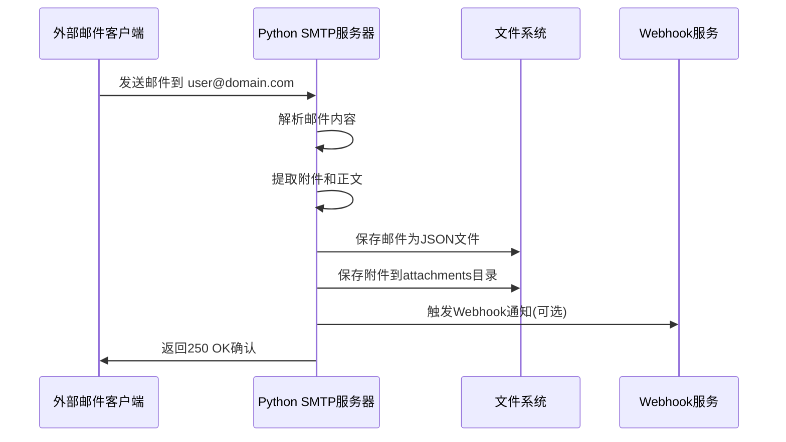

# OpenTrashmail 项目架构与实现原理分析

## 1. 项目概述

OpenTrashmail 是一个自托管的临时邮箱解决方案，允许用户接收邮件并通过 Web UI、JSON API、RSS 订阅和自定义 Webhook 来访问这些邮件。

### 核心特性
- **Python 驱动的邮件服务器**：开箱即用，支持任何域名
- **多种访问方式**：Web 界面、JSON API、RSS 订阅、Webhook
- **附件处理**：支持附件下载和管理
- **安全特性**：支持 TLS/STARTTLS 加密
- **文件存储**：100% 基于文件系统，无需数据库
- **灵活配置**：支持密码保护、IP 限制、自动清理等

## 2. 技术架构

### 2.1 整体架构
```
┌─────────────────┐    ┌─────────────────┐    ┌─────────────────┐
│   SMTP 服务器    │    │   Web 界面      │    │   文件存储      │
│  (Python)       │    │   (PHP/Nginx)   │    │   (JSON)        │
└─────────────────┘    └─────────────────┘    └─────────────────┘
         │                       │                       │
         │                       │                       │
         └───────────────────────┼───────────────────────┘
                                 │
                    ┌─────────────────┐
                    │   外部 Webhook   │
                    │   集成          │
                    └─────────────────┘
```

### 2.2 技术栈
- **后端 SMTP 服务器**：Python 3.11+ 
  - `aiosmtpd`：异步 SMTP 服务器库
  - `aiohttp`：HTTP 客户端用于 Webhook
  - `asyncio`：异步编程框架
- **Web 前端**：PHP 8.1+
  - Nginx：Web 服务器
  - PHP-FPM：PHP 处理器
  - HTMX：前端交互框架
- **容器化**：Docker + Docker Compose
- **存储**：基于文件系统的 JSON 存储

## 3. 目录结构分析

```
opentrashmail/
├── python/                     # Python SMTP 服务器
│   └── mailserver3.py         # 主要邮件服务器逻辑
├── web/                       # Web 界面和 API
│   ├── inc/                   # PHP 核心文件
│   │   ├── OpenTrashmailBackend.class.php  # 后端 API 处理
│   │   └── core.php           # 核心函数库
│   ├── index.php              # 主入口文件
│   ├── css/                   # 样式文件
│   ├── js/                    # JavaScript 文件
│   └── templates/             # HTML 模板
├── data/                      # 邮件数据存储目录
├── logs/                      # 日志文件目录
├── docker/                    # Docker 配置
│   ├── Dockerfile            # 容器镜像定义
│   └── rootfs/               # 容器文件系统
└── config.ini                # 主配置文件
```

## 4. 核心实现原理

### 4.1 邮件接收流程



#### 详细实现步骤：

1. **邮件接收** (`mailserver3.py` - `handle_DATA`方法)
   - 监听 SMTP 端口（默认 25）
   - 接收原始邮件数据
   - 验证收件人邮箱格式

2. **邮件解析**
   - 使用 `BytesParser` 解析邮件结构
   - 提取主题、发件人、收件人信息
   - 分离纯文本和 HTML 内容
   - 处理多部分邮件

3. **附件处理**
   - 检测并提取邮件附件
   - 生成唯一的附件 ID
   - 验证附件大小限制
   - 处理 Content-ID 引用

4. **数据存储**
   - 为每个邮箱地址创建独立目录
   - 邮件以时间戳命名的 JSON 文件存储
   - 附件保存在 `attachments/` 子目录

5. **Webhook 通知**
   - 支持全局和单邮箱 Webhook
   - 自定义 JSON 负载模板
   - 指数退避重试机制
   - HMAC-SHA256 签名验证

### 4.2 Web 界面架构

#### PHP 后端设计
- **单一入口点**：`index.php` 处理所有请求
- **路由系统**：基于 URL 路径的简单路由
- **模板系统**：PHP 原生模板渲染

#### API 端点设计
```
/api/address/{email}          # 列出邮箱的所有邮件
/api/read/{email}/{id}        # 读取特定邮件
/api/raw/{email}/{id}         # 获取原始邮件
/api/attachment/{email}/{id}  # 下载附件
/api/delete/{email}/{id}      # 删除邮件
/api/deleteaccount/{email}    # 删除整个邮箱
/api/webhook/*                # Webhook 配置管理
/json/{email}                 # JSON API
/rss/{email}                  # RSS 订阅
```

### 4.3 数据存储结构

#### 邮件存储格式 (`{timestamp}.json`)
```json
{
  "sender_ip": "192.168.1.100",
  "from": "sender@example.com",
  "rcpts": ["recipient@domain.com"],
  "raw": "原始邮件内容...",
  "parsed": {
    "subject": "邮件主题",
    "body": "纯文本正文",
    "htmlbody": "HTML正文",
    "from": "sender@example.com",
    "attachments": ["file1.pdf", "file2.jpg"],
    "attachments_details": [
      {
        "filename": "document.pdf",
        "cid": "content-id",
        "id": "unique-file-id",
        "download_url": "http://domain/api/attachment/...",
        "size": 1024
      }
    ]
  }
}
```

#### 目录结构
```
data/
├── user1@example.com/
│   ├── 1693737600000.json     # 邮件JSON文件
│   ├── 1693737650000.json
│   ├── webhook.json           # Webhook配置
│   └── attachments/           # 附件目录
│       ├── unique-id-file1.pdf
│       └── unique-id-file2.jpg
└── user2@example.com/
    └── ...
```

## 5. 完整工作流程

### 5.1 邮件接收和处理流程

1. **DNS 配置**
   - 设置 MX 记录指向服务器 IP
   - 支持通配符域名 (`*.example.com`)

2. **SMTP 服务器启动**
   - 读取 `config.ini` 配置
   - 启动异步 SMTP 监听器
   - 支持 TLS/STARTTLS 加密

3. **邮件处理链**
   ```
   接收邮件 → 验证域名 → 解析内容 → 提取附件 → 存储数据 → 触发Webhook
   ```

4. **域名验证逻辑**
   - 检查收件人域名是否在配置列表中
   - 支持通配符域名匹配
   - 可配置是否丢弃未知域名邮件

### 5.2 Web 访问流程

1. **用户访问** → **认证检查** → **路由分发** → **数据处理** → **响应返回**

2. **认证机制**
   - 密码认证（HTTP 头部或 GET/POST 参数）
   - IP 地址白名单
   - 管理员权限验证

3. **内容安全**
   - HTML 内容净化（移除脚本）
   - 附件安全下载
   - CSRF 保护

## 6. 核心功能实现细节

### 6.1 邮件服务器 (`mailserver3.py`)

#### 主要类和方法：
- **`CustomHandler`**：自定义 SMTP 处理器
  - `handle_DATA()`：处理邮件数据
  - `handleAttachment()`：处理附件
  - `send_to_webhook()`：发送 Webhook 通知

#### 关键特性：
- **异步处理**：使用 `asyncio` 实现高并发
- **编码处理**：支持 UTF-8 和 Latin1 编码
- **附件管理**：MD5 哈希生成唯一 ID
- **Content-ID 替换**：HTML 中的内联图片处理

### 6.2 Web 后端 (`OpenTrashmailBackend.class.php`)

#### 核心方法：
- **`run()`**：主路由分发器
- **`listAccount()`**：列出邮箱邮件
- **`readMail()`**：读取单个邮件
- **`getAttachment()`**：下载附件
- **Webhook 管理**：配置、保存、删除 Webhook

#### 安全特性：
- **输入验证**：邮箱格式、ID 数值验证
- **SSRF 防护**：禁止 Webhook 指向内网
- **文件路径安全**：防止路径遍历攻击

### 6.3 数据管理 (`core.php`)

#### 核心函数：
- **`getEmailsOfEmail()`**：获取邮箱的所有邮件
- **`generateRandomEmail()`**：生成随机邮箱地址
- **`removeScriptsFromHtml()`**：HTML 安全净化
- **IP 范围检查**：支持 IPv4/IPv6 CIDR

## 7. 配置和部署

### 7.1 配置文件结构 (`config.ini`)
```ini
[GENERAL]
DOMAINS=yourdomain.com,*.example.com  # 支持的域名
URL=http://localhost:8080             # Web界面URL

[MAILSERVER]
MAILPORT=25                          # SMTP端口
DISCARD_UNKNOWN=true                 # 是否丢弃未知域名邮件
ATTACHMENTS_MAX_SIZE=2000000         # 附件大小限制

[WEBHOOK]
WEBHOOK_URL=https://api.example.com  # 全局Webhook URL

[ADMIN]
ADMIN_ENABLED=false                  # 管理面板开关
ADMIN_PASSWORD=password              # 管理员密码
```

### 7.2 Docker 部署
- **基础镜像**：Alpine Linux 3.18
- **服务组合**：Nginx + PHP-FPM + Python SMTP
- **端口映射**：80 (Web)、25 (SMTP)、465 (TLS)
- **持久化**：`data/` 和 `logs/` 目录挂载

## 8. 安全机制

### 8.1 Web 安全
- **HTML 净化**：移除所有脚本标签和事件属性
- **文件上传安全**：严格的附件类型和大小检查
- **路径安全**：防止目录遍历攻击

### 8.2 网络安全
- **TLS 支持**：STARTTLS 和 TLS-on-Connect
- **IP 白名单**：限制访问来源
- **SSRF 防护**：Webhook URL 不能指向内网

### 8.3 认证授权
- **多重认证**：密码、HTTP 头部、Session
- **权限分离**：普通用户和管理员权限
- **API 安全**：统一的认证检查

## 9. 数据流分析

### 9.1 邮件接收数据流
```
外部邮件 → SMTP服务器 → 内容解析 → 附件提取 → JSON序列化 → 文件存储 → Webhook通知
```

### 9.2 Web 访问数据流
```
HTTP请求 → 路由解析 → 认证检查 → 文件读取 → 数据处理 → 模板渲染 → HTTP响应
```

### 9.3 API 调用数据流
```
API请求 → 参数验证 → 权限检查 → 数据查询 → JSON序列化 → 响应返回
```

## 10. 关键设计模式

### 10.1 单一职责原则
- **SMTP 服务器**：专注邮件接收和存储
- **Web 后端**：专注 HTTP 请求处理
- **模板系统**：专注视图渲染

### 10.2 工厂模式
- **Handler 工厂**：根据连接类型创建不同的处理器
- **模板工厂**：动态加载不同的模板文件

### 10.3 策略模式
- **Webhook 策略**：全局 vs 单邮箱 Webhook
- **存储策略**：文件系统存储策略

## 11. 性能优化

### 11.1 异步处理
- **SMTP 服务器**：异步处理多个连接
- **Webhook 调用**：非阻塞 HTTP 请求
- **文件 I/O**：优化的文件读写操作

### 11.2 缓存策略
- **配置缓存**：避免重复读取配置文件
- **模板缓存**：PHP 模板编译缓存

### 11.3 资源管理
- **内存管理**：及时释放大文件内存
- **连接池**：HTTP 客户端连接复用
- **文件清理**：自动删除过期邮件

## 12. 扩展性设计

### 12.1 插件化架构
- **Webhook 系统**：支持自定义负载模板
- **模板系统**：支持自定义 HTML 模板
- **配置系统**：灵活的 INI 配置

### 12.2 API 设计
- **RESTful API**：符合 REST 规范
- **版本兼容**：向后兼容的 API 设计
- **错误处理**：统一的错误响应格式

## 13. 监控和运维

### 13.1 日志系统
- **邮件服务器日志**：记录 SMTP 操作
- **Web 服务器日志**：记录 HTTP 访问
- **错误日志**：记录异常和错误

### 13.2 健康检查
- **服务状态监控**：SMTP 和 Web 服务状态
- **存储空间监控**：磁盘空间使用情况
- **性能监控**：响应时间和吞吐量

## 14. 部署和维护

### 14.1 容器化部署
```bash
# 简单启动
docker run -p 80:80 -p 25:25 hascheksolutions/opentrashmail:1

# 持久化部署
docker-compose up -d
```

### 14.2 配置管理
- **环境变量**：支持 Docker 环境变量配置
- **配置文件**：INI 格式的配置文件
- **运行时配置**：动态配置更新

### 14.3 备份策略
- **数据备份**：定期备份 `data/` 目录
- **配置备份**：备份配置文件
- **日志归档**：定期归档日志文件

## 15. 总结

OpenTrashmail 是一个设计良好的临时邮箱解决方案，具有以下优势：

### 15.1 架构优势
- **模块化设计**：各组件职责清晰，易于维护
- **异步架构**：高并发处理能力
- **文件存储**：简单可靠，无需数据库

### 15.2 功能优势
- **多接口支持**：Web、API、RSS、Webhook
- **安全性好**：多层安全防护机制
- **易于部署**：Docker 一键部署

### 15.3 扩展性
- **配置灵活**：丰富的配置选项
- **API 完整**：支持各种集成场景
- **模板化**：易于定制界面

这个项目展现了优秀的软件工程实践，结合了现代 Web 技术和传统邮件协议，为临时邮箱服务提供了完整的解决方案。
